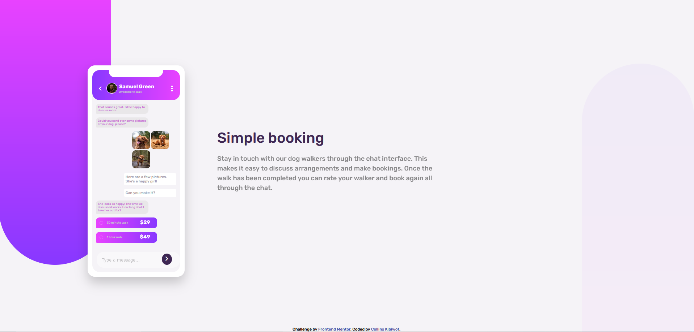
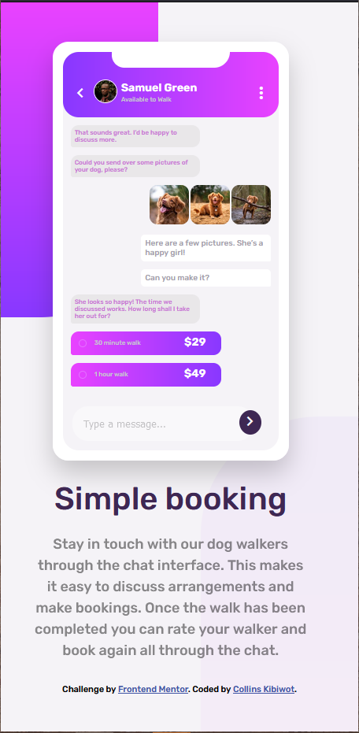

# Frontend Mentor - Chat app CSS illustration solution

This is a solution to the [Chat app CSS illustration challenge on Frontend Mentor](https://www.frontendmentor.io/challenges/chat-app-css-illustration-O5auMkFqY). Frontend Mentor challenges help you improve your coding skills by building realistic projects. 

## Table of contents

- [Overview](#overview)
  - [The challenge](#the-challenge)
  - [Screenshot](#screenshot)
  - [Links](#links)
- [My process](#my-process)
  - [Built with](#built-with)
  - [What I learned](#what-i-learned)
  - [Continued development](#continued-development)
  - [Useful resources](#useful-resources)
- [Author](#author)
- [Acknowledgments](#acknowledgments)

**Note: Delete this note and update the table of contents based on what sections you keep.**

## Overview

### The challenge

Users should be able to:

- View the optimal layout for the component depending on their device's screen size
- **Bonus**: See the chat interface animate on the initial load

### Screenshot





### Links

- Solution URL: [GitHub](https://github.com/kibiwotkosgei/chat-app.git)
- Live Site URL: [GitHub pages](https://kibiwotkosgei.github.io/chat-app/)


## My process
I built it starting with the mobile view then finally worked on the desktop view.It was fun and a great experience.

### Built with

- Semantic HTML5 markup
- CSS custom properties
- Flexbox
- Mobile-first workflow

### What I learned


I learnt on importance of having a plan.Well-scripted plan so as to avaid change of plan when part of the work is done.Design is paramount.

I learnt how to use before and after and also worked on my accesibility issues.

I maximized and enjoyed the use of display:none to test my code.


```html
<h1>Some HTML code I'm proud of</h1>
```
 <button class="round"type="submit"> <span class="material-symbols-outlined "> chevron_right </span> </button>

```css
.proud-of-this-css {

  main::before {
  content: "";
  background-image:linear-gradient(to bottom,var(--LightMagenta),var(--LightViolet));
  height: 400px;
  width: 200px;
  border-radius: 0 0 150px 0px;
  position: absolute;
  top: 0;
  left: 0;
  z-index: -1;
}

@media  screen and (min-width:620px) {

  main::before{
    height: 80%;
    width:310px;
    border-radius: 0 0 200px 200px;
  }
  main::after{
    height: 80%;
    width:310px;
    border-radius: 200px 180px 0 0;
  }
  main{
    margin: auto 0px auto 245px ; 
    display: flex;
    gap: 50px;            
  }
  .simplebooking{
    text-align: left; 
    margin: auto;  
  }
}
```


### Continued development

Keen on working on more frontend projects to practise the basics of css and html.
Also,working or correct and perfect workfow in my projects.


### Useful resources

- [W3schools website](https://www.w3schools.com/cssref/pr_text_text-align.ASP) - This helped me for alighnment reasons. I wanted to know how all alighnments work and am happy to say that I grasped it and I will use it easily on my way forward.
- [YouTube video](https://www.youtube.com/watch?v=2KL-z9A56SQ) -This is an amazing video that explains well how to use @media to create responsive websites. I'd recommend it to anyone still learning this concept.


## Author

- Frontend Mentor - [@kibiwotkosgei](https://www.frontendmentor.io/profile/kibiwotkosgei)
- GitHub - [@kibiwotkosgei](https://github.com/kibiwotkosgei)


## Acknowledgments
- [Lesley Kimutai](https://www.frontendmentor.io/profile/Leskim)  Helped debug my code.(git commit -m "I think Mount is very paramount at the bridge.Hahaha")

- [Kibenon Collins](https://www.frontendmentor.io/profile/collinskibenon)-Challenged me to do this cahllenge,guided me and was very insightful and inspiring.


